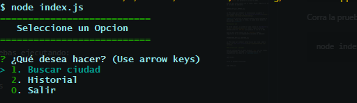
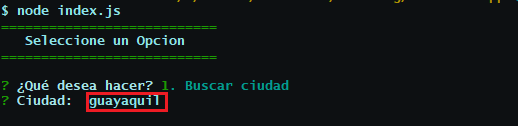
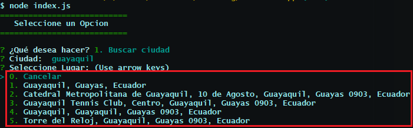
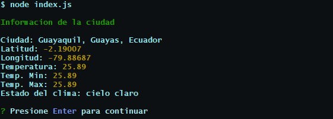
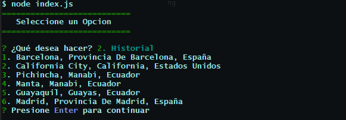

# weather-CLI

Weather-CLI us un proyecto didáctico en el que se desarrolla una aplicacion de una CLI usando conceptos relacionados a:

-   Consumo de APIs
-   Llamadas HTTP hacia servidores externos
-   Paquete request - superficialmente
-   Paquete Axios

La funcionalidad de centra en permitirle al usuario consultar el clima de una ciudad del mundo. El usuario inserta una locación y se le sugieren 5 opciones en función de que tán especifico haya sido.

Este puede escoger cualquiera de las opciones que mas se ajusten a su criterio y mostrar estadisticas de temperaturas y datos climáticos de la ciudad seleccionada.

## Tabla de Contenido

1. [Resumen](#resumen)
2. [Configuraciones previas](#configuraciones-previas)
3. [Instalación y pruebas](#instalación-y-pruebas)

## Configuraciones previas

Para provar este proyecto, usted debe tener las siguientes consideraciones:

-   [Configurar las variables de ambiente](#configurar-variables-de-ambiente)
-   [Access Token - Geocoding API](#geocoding-api)
-   [API Key - Weather API](#weather-api)

### Configurar variables de ambiente

En el repositorio, usted cuenta con el archivo **.env-example**. Este fichero contiene el nombre de las variables de ambiente que son usadas en los diferentes módulos.

Usted deberá renombrar este fichero **.env-example** con el nombre **.env** y luego llenar las variables de entorno con sus respectivos valores obtenidos de las APIs usadas.

```
MAPBOX_KEY=your_MAPBOX_key
OPENWEATHER_KEY=your_WEATHER_key
```

### Geocoding API

Si usted no tiene cuenta en [MapBox](https://docs.mapbox.com/), deberá registrarse para obtener/crear el `access-token` que permite el uso de las APIs.

Una vez que usted cuente con su token, deberá registrarlo en la variable de ambiente:

```
MAPBOX_KEY=your_MAPBOX_key
```

La API usada para obtener la localizacion y sugerir 5 localidades similares, es [Geocoding API Playground](https://docs.mapbox.com/playground/geocoding/).

**Nota:** El servicio es gratutio hasta cierta cantidad de peticiones. Para crear el token, lo puede hacer desde la pestaña de **Tokens**.

### Weather API

De forma similar, si usted no tiene cuenta en [OpenWeather](https://openweathermap.org/), deberá registrarse para obtener/crear el `API Key` que permite el uso de la API.

Una vez que usted cuente con su `API Key`, deberá registrarlo en su correspondiente variable de ambiente:

```
OPENWEATHER_KEY=your_WEATHER_key
```

La API usada para obtener estadísticas del clima y demás datos, es [API call Current](https://openweathermap.org/current).

### Instalación y pruebas

Una vez configurado el ahora archivo `.env` con los tokens correspondientes, procede a la instalación de las dependencias mostradas en el **package.json**.

```
npm install
```

Corra la pruebas ejecutando:

```
node index.js
```

#### Menu principal

El menu principal está conformado por busqueda de las ciudades que se desea buscar y el historial de las 6 ultimas busquedas.



#### Consultar ciudades

Consultaremos sobre la ciudad de Guayaquil y veremos las recomendaciones que ofrece da el buscador.



Luego de buscar por la ciudad de Guayaquil, nos muestra las recomendaciones.



Esocgemos la opcion 1 y observamos los resultados de la busqueda.



#### Verificar Historial

Para la verificación del historial, en el directorio **/db** se crea el archivo _.database.json_ que contendrá las 6 útimas ciudades buscadas.


